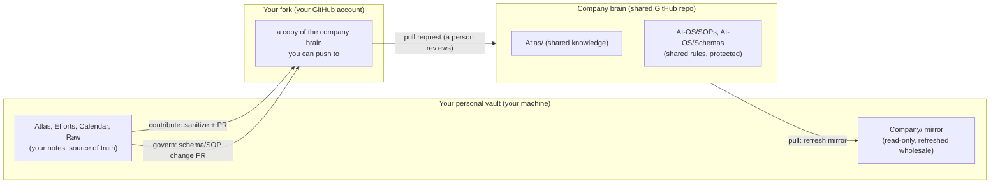

# Guide: Federation Overview (Start Here)

Audience: everyone. This is the front door to federation. It explains the shape of the system in one page and points you to the right detailed guide for your role.

Federation lets many personal vaults, each built from this template, share one company knowledge base. You pull shared knowledge into a read-only mirror, and you propose your own notes back as reviewable pull requests. Privacy is default-deny: a note leaves your vault only when you explicitly mark it and it passes a safety check. No git knowledge is required to take part; an AI agent runs every git action for you and confirms before anything is pushed.

## The two repositories

There are exactly two kinds of repository, and one schema shared between them.

Your personal vault is yours. The company brain is shared and protected: nobody can push to its `main` directly, so every change arrives as a pull request that a human reviews. Your fork sits in between; it is your own writable copy of the company brain that your agent pushes to before opening a pull request. The company brain is itself a Munin vault built from this template, so it looks and works like yours.

## The three flows

- **Pull (company to you, read-only).** Your agent refreshes the `Company/` folder in your vault with the latest shared knowledge, wholesale. It never touches your personal notes and can never cause a conflict. This is the safe first thing everyone does.
- **Contribute (you to company, knowledge).** You mark a note `share: company`; your agent sanitizes it, routes it into the company `Atlas/`, validates it, and opens a pull request from your fork. A note ships only if it is marked AND its type routes to `Atlas/` AND it passes a risk check. Two confirmations stand between you and anything being pushed.
- **Govern (you to company, the rules).** A change to the shared schema or a shared SOP travels a separate path (`fed:govern`), opens a pull request labelled `governance`, and is held to a higher review bar. This keeps a stray share marker from ever altering the company standard.

## The three roles, and where each reader goes

| Your situation | What you do | Read this |
|---|---|---|
| Setting up the shared brain for a team | Create the company repo, protect `main`, add reviewers, review incoming pull requests | [[federation-admin-setup]] |
| Onboarding employees onto an existing brain | Hand out the `companyRepo` value and the starter message; introduce consume first, contribute later | [[federation-rollout]] |
| Employee who wants to read shared knowledge | Set up once, then pull the read-only `Company/` mirror whenever you want the latest | [[federation-for-non-git-users]] |
| Employee who wants to share a note back | Mark the note, preview the sanitized copy, confirm, and let the agent open the pull request | [[federation-for-non-git-users]] |
| Employee proposing a change to a shared rule | Ask the agent to request a schema or SOP change through the governance path | [[federation-schema-change]] |

## The agent-facing procedures

Behind the human guides sit the SOPs your AI agent follows step by step. You do not need to read these, but they are the exact procedures being run on your behalf:

- [[federation-setup]]: one-time connection (sign in, fork, clone, fill config).
- [[federation-pull]]: refresh the company mirror and narrate what changed.
- [[federation-contribute]]: suggest, mark, preview, confirm-before-push, confirm-before-PR.
- [[federation-schema-change]]: the governance path for schema and SOP changes.

## What is guaranteed, always

- **Your private notes stay private.** Nothing leaves unless you explicitly mark it; unmarked is the default and means "never".
- **Marking is not enough on its own.** A marked note still has to be shareable knowledge (the right type, routing to `Atlas/`) and still has to pass a risk check for things like email addresses.
- **You never get write access to company `main`.** You propose through a pull request; a human reviewer accepts. That is a repository setting the admin turns on, not a matter of trust.
- **Every git action is previewed and confirmed.** Dry-run first, then a diff preview, then an explicit yes before any push, and a second yes before any pull request.
